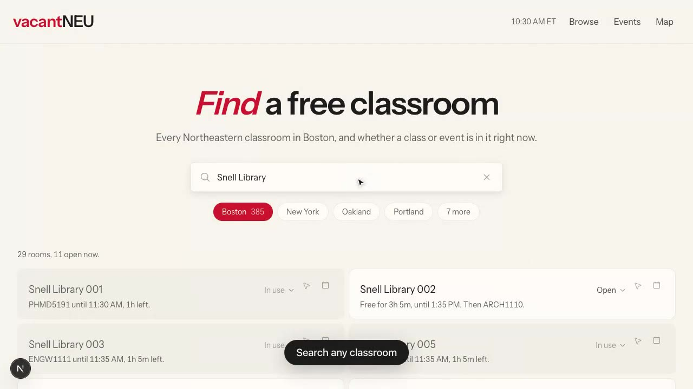

# vacantNEU

Find an empty classroom at Northeastern.

**[Live at vacantneu.vercel.app](https://vacantneu.vercel.app)** · [Watch the demo](demo/vacantneu-demo.mp4)

[](demo/vacantneu-demo.mp4)

Every course catalog answers "where is my class?". vacantNEU answers the inverse: **which rooms
have no class in them right now?** A room's free time is the complement of its class bookings, so
the whole product is one dataset — the registrar's room schedule — read backwards.

## Status

**All four phases are complete and verified.**

- **Phase 1** Banner scraper, vacancy engine, Fall 2026 artifact
- **Phase 2** Home page: search a room, see whether a class is in it
- **Phase 3** Browse: every classroom, filtered by building, by how long it stays free, and at
  any date and time rather than only right now
- **Phase 4** Map: real building footprints, clickable, labelled with open room counts
- **Events** `/events`: club events from Engage, a week at a time, searchable by club

Room cards and the map panel link to walking directions, opening Apple Maps on Apple devices and
Google Maps elsewhere. Boston only: the coordinates come from the OpenStreetMap query around that
campus, so buildings anywhere else simply show no link.

Home shows the four largest campuses as pills with the rest behind a "more"; Browse uses a native
select, since it already carries three other controls. Both filter to one campus at a time. Pooling them would make "412 rooms are open"
true and useless when some are on another continent. The map stays on Boston: its footprints come
from OpenStreetMap around that campus, so it cannot draw a room in Oakland.

Any room card, on Browse or in the map panel, opens a **day timeline**: the whole day drawn to
scale against an hour grid, steppable day by day, with classes and club bookings distinguished.
A list of start times cannot show where the gaps are; a timeline can.

| | |
|---|---|
| Term | Fall 2026 (`202710`) |
| Campuses | 11 (Boston 385 rooms, New York 59, Oakland 43, plus 8 more) |
| Not covered | London: Banner publishes no room for any of its 282 meeting rows |
| Boston buildings | 40 (38 mapped: 36 with footprints, 2 as points) |
| Rooms | 566 across all campuses |
| Scheduled class meetings | 4,516 |
| Club event bookings | depends on the Engage session (see below) |
| Artifact size | 1.1 MB raw / **86 KB gzipped** |

## How it works

```
Banner 9 Self-Service API  ->  Zod validation  ->  transform  ->  data/202710.json
    (nubanner.neu.edu)         (fail loudly)      (normalize)      (committed, 86 KB gz)
                                                                          |
                                              packages/core/vacancy.ts <--+
                                              (pure: isFree, nextTransition)
                                                          |
                                          home / map / browse all read the same answer
```

Class data comes from Northeastern's **Banner 9 Self-Service API** — the same public,
unauthenticated endpoint SearchNEU's scraper reads. A full term is ~20 paginated requests
(`searchResults` accepts no subject filter, so one sweep covers the whole catalog).

### Why there's no database

The entire Boston room schedule is 86 KB gzipped and effectively immutable within a term. A
database would add cost, latency, and ops burden while making the product worse — every "is this
room free?" query would become a network round trip for arithmetic the browser can do instantly.
The scraper emits a static JSON artifact instead.

The artifact is modeled as normalized tables (`buildings` / `rooms` / `meetings`), so if the app
later needs accounts, saved rooms, or crowdsourced occupancy reports, adding Postgres is a loader
script rather than a rewrite.

## Commands

```bash
pnpm install

pnpm scrape                    # scrape current term -> data/<term>.json
pnpm scrape --dry-run          # scrape and report, write nothing
pnpm scrape --term 202710      # pin a specific term

pnpm events                    # scrape club events from Engage -> data/events.json
pnpm events --dry-run          # fetch and report, write nothing

pnpm buildings                 # regenerate map footprints from OpenStreetMap (run rarely)

pnpm inspect                   # list buildings
pnpm inspect --free            # what's free right now
pnpm inspect --room DG-070     # one room's full weekly schedule
pnpm inspect --building SL     # every room in a building, with live status
pnpm inspect --free --at 2026-09-16T14:30

pnpm demo                      # record a walkthrough video (see tools/demo)

pnpm test                      # 83 unit tests
pnpm typecheck

pnpm --filter @vacantneu/web dev     # http://localhost:3000
pnpm --filter @vacantneu/web build   # static export to apps/web/out
```

`apps/web` reads `data/` through a prebuild step, so run `pnpm scrape` at least once first.

`pnpm inspect --room` exists so a human can compare a room against Banner's own UI. Automated
tests prove the code matches our assumptions; only that comparison proves the assumptions match
reality.

## Layout

```
apps/web/            Next.js 15 static export. Home page, design tokens, client vacancy rendering.
packages/core/       Pure vacancy engine + types. No dependencies. Shared by scraper and UI, so
                     there is exactly one definition of "free".
packages/scraper/    Banner client, Zod schemas, transform, OSM building matching, CLIs.
data/                Generated artifacts (committed) + the hand-maintained academic calendar.
```

## The web app

Vacancy depends on the current minute, so it cannot be prerendered. The page ships as a static
shell, fetches the artifact, and recomputes against the visitor's clock on each minute boundary.
That keeps 741 KB of schedule out of the JS bundle and lets the CDN revalidate data without a
code deploy. First load is 119 KB of JS.

All reasoning happens in campus time rather than the visitor's, so a student checking from a
laptop still set to Pacific sees the same answer as one standing in the hallway.

Design language is the Lovable system with Northeastern red (`#c8102e`) as the accent. Free and
occupied rooms are distinguished by surface weight rather than a green/red pair, keeping the one
saturated colour reserved for a room about to be reclaimed. Status is never carried by colour
alone. Dark mode keeps the palette's warmth instead of inverting it, and lightens the accent,
which only reaches 3.0:1 against a dark surface at full strength.

The map uses MapLibre with OpenFreeMap vector tiles, which need no API key. The borrowed basemap
style is recoloured onto our palette before the map is constructed, and building footprints come
from OpenStreetMap via `pnpm buildings`.

### Analytics

Traffic counting is off until you configure it. Copy `apps/web/.env.example` to
`apps/web/.env.local` and set a provider and token:

```
NEXT_PUBLIC_ANALYTICS_PROVIDER=cloudflare   # or plausible, or umami
NEXT_PUBLIC_ANALYTICS_ID=your-token
```

All three supported providers are cookieless and count page views without building a visitor
profile. That is deliberate: it keeps the Privacy Policy short and true, and it means the app
still collects no personal information. Cloudflare Web Analytics is free and works on any host.

### Legal

`/terms` and `/privacy` are written for what this app actually does. It has no accounts, no
sign-in, and no notifications, so the usual clauses about credentials, phone numbers, and message
rates were removed rather than carried over. They are adapted templates, not legal advice.

## Club events

A room is occupied if anything is in it, so club events from
[Engage](https://engage.northeastern.edu) are ingested as bookings alongside classes. To the
vacancy engine they are the same `Meeting` shape: an event is simply a meeting whose date range is
a single day. Events crossing midnight are split at it, because the engine reasons in minutes
within one day.

`/events` lists every event Engage publishes, whether or not its venue resolves to a room. Most
do not, so they say nothing about classroom availability, but they are still the answer to "what
is on today".

`packages/scraper/src/location.ts` resolves Engage's free-text venues ("West Village H Room 110",
"EV 8", "Robinson Hall 409") to room ids. It only ever returns a room that exists in the artifact:
naming a building we know is not licence to invent a room inside it, so "Behrakis 4th floor labs"
resolves to nothing rather than to a guess.

### The Engage session

The endpoint answers anonymous requests, but redacts most venues to
`Private Location (sign in to display)`. On an anonymous pull roughly 95% of events have no usable
location, which makes the feature close to worthless. Supplying a CampusGroups session fixes that:

```
ENGAGE_SESSION_ID=...
ENGAGE_UID=...
```

Sign in to Engage in a browser, then DevTools → Application → Cookies → engage.northeastern.edu.
This is CampusGroups' own session rather than Northeastern SSO, so the values are portable and no
MFA replay is needed.

**Copy the values verbatim.** The session token contains percent sequences (`%2b`, `%3d`) and
CampusGroups expects them exactly as stored. Decoding them first produces a token the server does
not recognise, and it will not tell you: it silently mints a fresh anonymous session and serves a
200 with every venue redacted, so the scrape looks like it worked and quietly finds nothing.

`pnpm events` exits 2 with a clear message when the session is refused. It detects this from the
server replacing the cookie, which only happens when the one sent was rejected; a session Engage
accepts is left untouched. The workflow surfaces that as a warning without failing the run.

With a working session the difference is stark: venue redaction drops from 336 of 352 events to
2 of 238, and matched bookings go from 1 to 18.

A university holiday cancels classes, not the building, so the holiday rule suppresses classes
only. A club event listed on Veterans Day still occupies its room, which is exactly when clubs
book them.

Events are written to a **separate** `data/events.json` and loaded separately by the browser. That
separation is deliberate: Engage is an undocumented endpoint behind an expiring credential, and a
failure there degrades the answer rather than taking down the class schedule, which is what the
app is actually for.

## Two things that are easy to get wrong

**Banner does not encode holidays.** A meeting row says "Mon/Wed, 09/09–12/20" and will happily
claim its room is occupied on Thanksgiving. `packages/core/src/calendar.ts` is transcribed by hand
from the registrar's PDF and **must be reviewed every academic year**. It is the only input to the
pipeline that cannot be scraped.

**"Nothing scheduled" is still not "unlocked and available."** Club events close part of this
gap, but only the part Engage publishes with a resolvable room. Departments book rooms directly,
exams follow a schedule nobody publishes through these sources, and a room with nothing in it can
simply be locked. We also only know a room exists if a class was scheduled in it, so the real
classroom inventory is larger than 385. This is a limitation of the data sources, not a bug: the
UI says "no class scheduled here" rather than "free," or it will send people to locked doors.

## Safety

The scraper refuses to publish an artifact with implausibly few buildings, rooms, or meetings.
A Banner outage returning an empty result set would otherwise mark every room on campus free —
the most damaging thing this app could do. Failing and keeping yesterday's data is always better.

`.github/workflows/scrape.yml` re-scrapes daily, runs the test suite as a gate, and commits only
when the schedule actually changed.

## Data source

Northeastern Banner 9 Self-Service, `https://nubanner.neu.edu/StudentRegistrationSsb/ssb`.
Public and unauthenticated. The scrape is ~20 requests per day with a courtesy delay between
them. Building footprints come from OpenStreetMap via Overpass.
